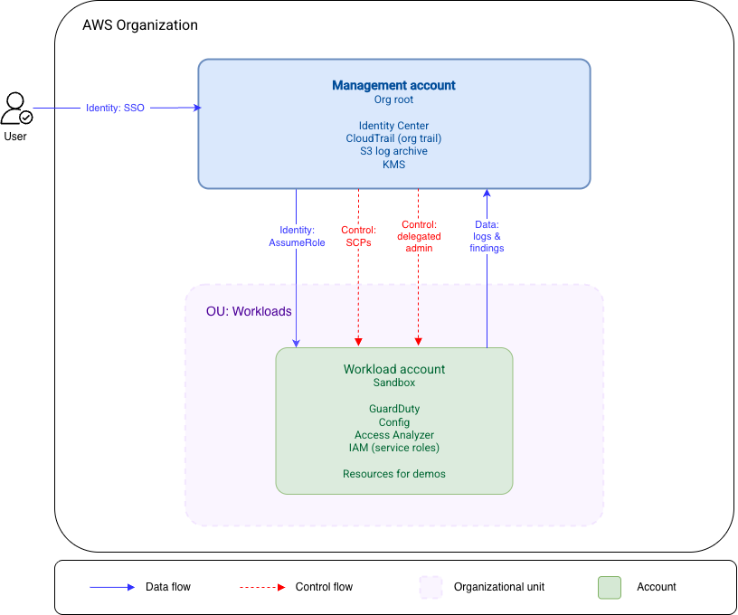

> [!NOTE]
> **Status**: Phase 1 build in progress\
> **May 29 target**: Governance layer complete

# AWS Security Baseline & Guardrail Architecture

A multi-account AWS Organization implementing security guardrails: SCPs, centralized logging, and (in Phase 2) detection services with delegated administration.

This treats security as reliability.  Controls are preventative wherever possible, detective where necessary, and deferred where they would generate noise without a remediation path.

## Architecture

## Scope
### Phase 1
#### Shipped
- AWS Organization with management account and one workload account
- One Workloads OU
- Terraform with remote state

#### In progress
- Service Control Policies applied at the OU level
- Organization-level CloudTrail trail
- KMS-encrypted S3 bucket for log storage

### Phase 2
- Identity Center for human access, with permission sets
- GuardDuty with delegated administration
- AWS Config with organization aggregator
- IAM Access Analyzer at the organization level
- IAM baseline (break-glass role, baseline permission boundaries)

### Deliberately deferred
**Security Hub** -- Aggregates findings from GuardDuty, Config, and Access Analyzer.  Aggregation has no value without a triage and remediation workflow.  Absent that workflow, Security Hub is a second dashboard producing the same findings surfaced elsewhere, at an additional cost.  Deferring to the Automated Remediation Pipeline project, where it connects detection and automated response.

**WAF, Shield Advanced, Network Firewall** -- Advanced controls not justified by this portfolio's threat model.

## Design decisions
**Identity Center with built-in directory**

Alternatives considered: IAM users per account, Identity Center federated to an external IdP.

Chose Identity Center with the built-in directory because IAM users in each account create credential sprawl that doesn't scale beyond two or three accounts.  An external IdP adds infrastructure complexity and cost that are not justified for an environment with one human user.  Identity Center centralizes human access at the org level and lets permission sets be assigned to accounts, which is the pattern that would extend cleanly to a production environment.  This work lands in Phase 2.

**DynamoDB lock table for state locking**

Alternatives considered: Newer versions of Terraform support native S3-based locking with `use_lockfile`, replacing the use of DynamoDB.

Chose to keep the DynamoDB pattern because it matches what production environments likely run today while demonstrating the distributed-systems reasoning behind state locking.  A future upgrade would migrate to `use_lockfile` and decommission the DynamoDB table.

## How this was built
**Environment Bootstrap**

Before I could create any organization-level resources, Terraform needed somewhere to write state, ideally with locking to prevent concurrent runs from corrupting it.  This creates a chicken-and-egg problem: the standard pattern is remote state in S3 with a DynamoDB lock table.  With a new environment, those resources don't yet exist and Terraform won't init against a bucket it can't reach.

I solved it by writing the bootstrap config with no backend block, defaulting to local state on disk.  The first apply created the S3 bucket and DynamoDB table.  I then added the backend configuration and reran `terraform init`.  Terraform detected the new backend and prompted for migration.  From that point, it manages its own state from inside the infrastructure it provisions.  Creating these resources from console would have been faster, but would have broken the IaC pattern this project depends on.

One deferred decision worth mentioning: Terraform recently introduced native S3 locking with `use_lockfile`, deprecating the DynamoDB approach.  I kept DynamoDB because it matches what many production environments likely run and demonstrates the distributed-systems reasoning behind state locking.

For authentication during the bootstrap phase, I created an IAM user with scoped admin permissions to the sandbox account.  Identity Center is the production pattern and is scoped for Phase 2.  It requires the organization management account to exist first, which is the bootstrap work of Phase 1.

With state management and authentication in place, the next step is to create the AWS Organization itself.

## Reproducing this environment

## Repo structure

 
