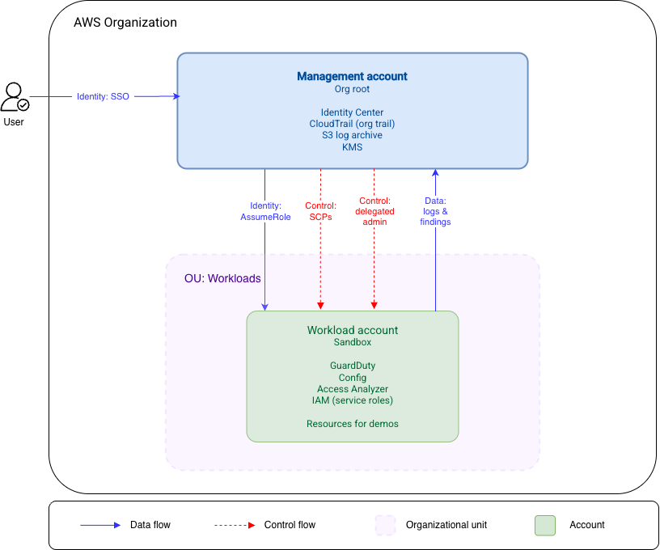
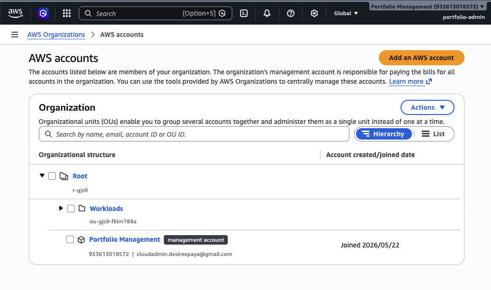
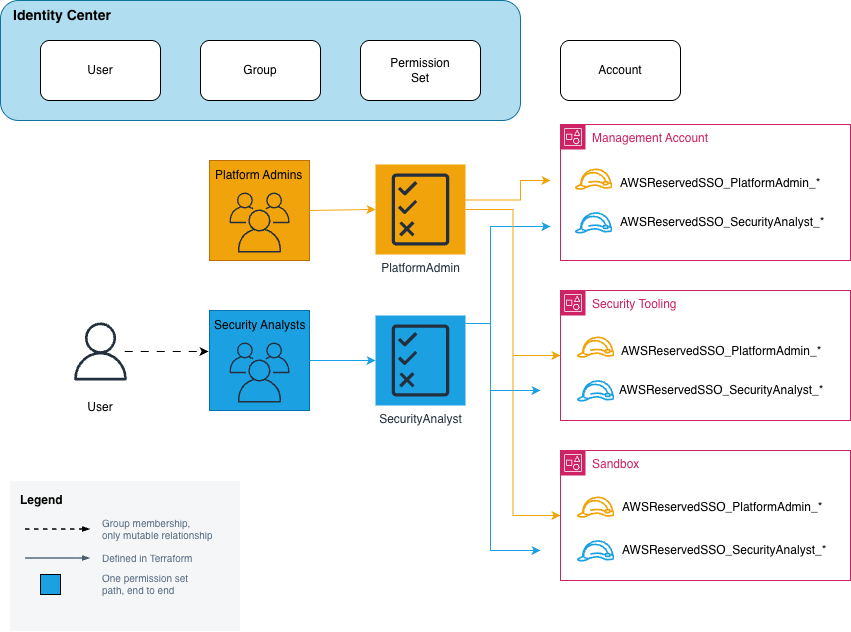

> [!NOTE]
> **Status**: Phase 2 build in progress

# AWS Security Baseline & Guardrail Architecture

A multi-account AWS Organization implementing security guardrails: SCPs, centralized logging, and (in Phase 2) detection services with delegated administration.

This treats security as reliability.  Controls are preventative wherever possible, detective where necessary, and deferred where they would generate noise without a remediation path.

## Architecture


## Scope
### Shipped
#### Phase 2
- Identity Center for human access, with permission sets

#### Phase 1
- AWS Organization with management account and one workload account
- One Workloads OU
- Terraform with remote state
- Service Control Policies applied at the OU level
- KMS-encrypted S3 bucket for log storage
- Organization-level CloudTrail trail

#### Phase 1 governance layer
The focus of this section was establishing a secure foundation for this environment.  With the completion of SCP, KMS, and S3 work, I now have the preventative controls in place at the organization level.
What this enables:
- **Region containment:** Prevents access or provisioning of resources outside of the target region.
- **CloudTrail protection:** An SCP prevents member accounts from disabling or deleting CloudTrail, protecting the org trail once it's deployed.
- **Storage hardened for the org trail:** KMS encryption at rest, bucket versioning, and ownership enforcement maintain log integrity once logs flow.
- **Verified controls:** Each control was verified against its intended behavior using a documented test matrix.

### Phase 2
- Identity Center for human access, with permission sets
- IAM baseline (break-glass role, baseline permission boundaries)
- GuardDuty with delegated administration
- AWS Config with organization aggregator
- IAM Access Analyzer at the organization level

### Deliberately deferred
**Security Hub** -- Aggregates findings from GuardDuty, Config, and Access Analyzer.  Aggregation has no value without a triage and remediation workflow.  Absent that workflow, Security Hub is a second dashboard producing the same findings surfaced elsewhere, at an additional cost.  Deferring to the Automated Remediation Pipeline project, where it connects detection and automated response.

**WAF, Shield Advanced, Network Firewall** -- Advanced controls not justified by this portfolio's threat model.

## Design decisions
**Identity Center with built-in directory**

Alternatives considered: IAM users per account, Identity Center federated to an external IdP.

Chose Identity Center with the built-in directory because IAM users in each account create credential sprawl that doesn't scale beyond two or three accounts.  An external IdP adds infrastructure complexity and cost that are not justified for an environment with one human user.  Identity Center centralizes human access at the org level and assigns permission sets to accounts, which is the pattern that would extend cleanly to a production environment.

**DynamoDB lock table for state locking**

Alternatives considered: Newer versions of Terraform support native S3-based locking with `use_lockfile`, replacing the use of DynamoDB.

Chose to keep the DynamoDB pattern because it matches what production environments likely run today while demonstrating the distributed-systems reasoning behind state locking.  A future upgrade would migrate to `use_lockfile` and decommission the DynamoDB table.

## How this was built
### Phase 1
### Environment bootstrap

Before I could create any organization-level resources, Terraform needed somewhere to write state, ideally with locking to prevent concurrent runs from corrupting it.  This creates a chicken-and-egg problem: the standard pattern is remote state in S3 with a DynamoDB lock table.  With a new environment, those resources don't yet exist and Terraform won't init against a bucket it can't reach.

I solved it by writing the bootstrap config with no backend block, defaulting to local state on disk.  The first apply created the S3 bucket and DynamoDB table.  I then added the backend configuration and reran `terraform init`.  Terraform detected the new backend and prompted for migration.  From that point, it manages its own state from inside the infrastructure it provisions.  Creating these resources from console would have been faster, but would have broken the IaC pattern this project depends on.

One deferred decision worth mentioning: Terraform recently introduced native S3 locking with `use_lockfile`, deprecating the DynamoDB approach.  I kept DynamoDB because it matches what many production environments likely run and demonstrates the distributed-systems reasoning behind state locking.

For authentication during the bootstrap phase, I created an IAM user with scoped admin permissions to the sandbox account.  Identity Center is the production pattern and was completed in Phase 2.  It required the organization management account to exist first, which is the bootstrap work of Phase 1.

With state management and authentication in place, the next step creates the AWS Organization itself.

### AWS Organization

I decided to use an organizational unit (OU) because I wanted this project to demonstrate production patterns.  The work to attach SCPs to a single-account OU is the same as an OU with dozens of accounts, and this approach builds that muscle memory.

I also created a separate sandbox account for running workloads instead of having them run in the management account.  This might seem like unnecessary overhead, but that obscures two important implementation details.  First, SCPs don't apply to the management account, so I'd need a separate account to demonstrate SCP attachment anyway.  Second, the management account is for org administration, not workloads.  Running workloads there creates a blast-radius problem, where a compromised workload would threaten org administration itself.

Here is the final state after applying all changes in Terraform:



### Organization-level Logging

The last piece to pull all this foundational work together was implementing CloudTrail at the organization level.  This captures logs for both the admin and member accounts and is the prerequisite for implementing detective controls.  Testing the trail end-to-end was the final validation of the infrastructure and preventative controls.

---

### Phase 2
### Identity Center
My intent from the beginning was to get to a centralized human access model.  As described above, I needed an admin-level IAM user to bootstrap the environment, but I didn't want to rely on long-lived credentials for this project.  This user will remain active until I've completed the IAM baseline work.  With the bootstrap of Phase 1 done, I shifted to configuring Identity Center for human access.  

My mental model was rooted in groups unlocking access for individual users.  As I refined access for each user persona, I discovered I couldn't rely solely on AWS managed policies for some use cases.  For example, the `SecurityAnalyst` persona maps to the AWS managed policy enabling investigations, `SecurityAudit`.  But if an analyst discovers an issue that requires remediation, she doesn't have permissions in that account to make changes.  She would need to escalate to a `PlatformAdmin` or I would need to add a different AWS managed policy -- `AdministratorAccess` -- to the permission set.  Ideally, I would scope this as a temporary elevation of privileges by assuming a different role, say `SecurityRemediation`, but AWS doesn't have a managed policy like that.  I chose to defer custom policies to the IAM baseline step, which simplified this initial implementation.

One thing that surprised me is how permission set assignments and provisioned roles differ in this model.  Permission sets are an Identity Center artifact and are *assigned* to groups in my implementation.  That assignment scales with the number of *groups* who need access.  By contrast, roles provisioned as part of that assignment scale as the product of *accounts* and *permission sets*.  If I assigned an existing permission set to a new group, the assignments would increase but the provisioned roles would stay the same.  This underscores the benefit of group membership for human access: users can be added or removed from groups without policy changes, editing roles, or applying Terraform.  This diagram illustrates how that interaction of groups, permission sets, and accounts impacts role count:



## Reproducing this environment

### Establish credentials
You will need an initial set of credentials to start.  Creating a new account with AWS is straight-forward.
- Follow the setup instructions on [AWS's website](https://aws.amazon.com/).
- Create an IAM user with admin permissions.
- Add the IAM admin user credentials to your local AWS config.  This is your management profile.

### Bootstrap local state then migrate to remote backend
Terraform will need to write to a local state file initially.  
- Bootstrap the environment with an S3 bucket and a DynamoDB table.
- Once both resources exist, add a `backend` block to `providers.tf`.  See [note](terraform/bootstrap/providers.tf) for build sequence.
- Rerun `terraform init` and it should pick up the remote backend.

### Build organization resources
These configurations are established in a separate `org/` module.
- Create the organization, OU, SCPs, sandbox (member) account.
- Note: the sandbox account requires a unique email address.  
- Create a sandbox profile in your local AWS config with the new credentials.  The second profile is used during validation testing.

>[!WARNING]
>An AWS account doesn't fully delete on `terraform destroy`.  It's marked for deletion after a delay.  This impacts what email you used to create the account, since it can't be immediately reused.

### Verification
- Testing steps are documented in [Verification](docs/verification.md).
- Note: when testing Insecure Transport (Test 5.4), `InvalidArgument` is an expected result.  KMS's default TLS enforcement makes it difficult to cleanly isolate a denial from the bucket policy.

## Repo structure
  ```bash
  ├── aws-security-baseline
  │   ├── docs
  │   │   ├── adr
  │   │   │   ├── 0001-security-tooling-account.md
  │   │   │   ├── 0002-centralized-delegated-admin-security-tooling.md
  │   │   │   ├── 0003-identity-foundation.md
  │   │   ├── build_notes.md
  │   │   ├── images
  │   │   │   ├── guardrail_scope_diagram.png
  │   │   │   ├── identity_path_diagram.png
  │   │   │   └── organizations-console.png
  │   │   ├── outputs-phase1.txt
  │   │   └── verification.md
  │   ├── LICENSE
  │   ├── README.md
  │   └── terraform
  │       ├── bootstrap
  │       │   ├── main.tf
  │       │   ├── outputs.tf
  │       │   └── providers.tf
  │       ├── org
  │       │   ├── cloudtrail.tf
  │       │   ├── identity_center.tf
  │       │   ├── kms.tf
  │       │   ├── main.tf
  │       │   ├── outputs.tf
  │       │   ├── policies
  │       │   │   ├── cloudtrail_kms_key.json.tpl
  │       │   │   ├── cloudtrail_s3_bucket_policy.json.tpl
  │       │   │   ├── deny_cloudtrail_tampering.json
  │       │   │   ├── deny_idc_account_instance_creation.json
  │       │   │   └── restrict_regions.json
  │       │   ├── providers.tf
  │       │   ├── s3.tf
  │       │   └── scps.tf
  │       └── security-tooling
  │           ├── main.tf
  │           ├── providers.tf
  │           ├── terraform.tfvars
  │           └── variables.tf
